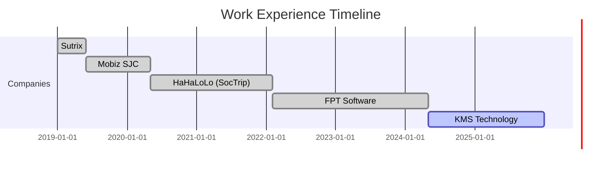

#  Hi there, I'm Henry Nguyen!

<div align="center">
  
  
  [](https://git.io/typing-svg)
</div>

<div align="center">
  


[](https://github.com/henrynguyendual)


[](https://www.linkedin.com/in/henrynguyendual)
[](mailto:henrynguyen.dual@gmail.com?subject=Hi%20Lam%20%F0%9F%91%8B)

</div>

<br>

<div align="center">
  <picture>
    <source media="(prefers-color-scheme: dark)" srcset="https://raw.githubusercontent.com/platane/platane/output/github-contribution-grid-snake-dark.svg">
    <source media="(prefers-color-scheme: light)" srcset="https://raw.githubusercontent.com/platane/platane/output/github-contribution-grid-snake.svg">
    
  </picture>
</div>

## 💫 About Me

```typescript
const henry = {
  fullName: "Nguyen Hoang Lam",
  nickname: "Henry",
  title: "Senior Full-Stack Engineer",
  location: "Vietnam 🇻🇳",
  philosophy:
    "🌟 Embrace challenges, learn endlessly, fail forward, and rise stronger every time",
  currentFocus: {
    work: "Building Insurance Web App @ Lexis Nexis",
    learning: ["AI/ML", "Generative AI", "LLM", "Speech Processing"],
    improving: ["DSA", "Big Data", "Data Analysis"],
  },
  passions: [
    "👨‍💻 Coding",
    "🎮 Game Development",
    "✈️ Traveling",
    "📚 Reading",
    "👨‍👩‍👧 Family Time",
    "📱 Tech News",
  ],
  funFact:
    "💡 Can't sleep when I have an exciting idea until I build it or write it down!",
};
```

## 🚀 Tech Stack & Skills

### 💻 Programming Languages

<div align="center">

[](https://skillicons.dev)

</div>

### 🎨 Frontend Development

<div align="center">

[](https://skillicons.dev)
[](#) [](#) [](#) [](#) [](#) [](#) [](#) [](#) [](#)

[](https://skillicons.dev)
[](#)

</div>

### ⚙️ Backend Development

<div align="center">

[](https://skillicons.dev)

</div>

### 💾 Databases & Message Queues

<div align="center">

[](https://skillicons.dev)

[](https://skillicons.dev)

</div>

### ☁️ Cloud & DevOps

<div align="center">

[](https://skillicons.dev)
[](#)

[](https://skillicons.dev)

</div>

### 🧪 Testing

<div align="center">

[](https://skillicons.dev)

</div>

### 🤖 Tools

<div align="center">

[](https://skillicons.dev)

</div>

### 🤖 AI

<div align="center">

[](#) [](#) [](#) [](#) [](#) [](#) [](#)

</div>

### 🤖 Other

<div align="center">

[](#) [](#) [](#) [](#)

[](#) [](#)

[](#) [](#) [](#) [](#) [](#) [](#) [](#)

[](#)

</div>

## 🌐 Language Proficiency

<div align="center">

### English Proficiency

 &nbsp;
 &nbsp;
 &nbsp;


</div>

**💬 Communication Skills:**

- ✅ Professional communication in international teams
- ✅ Technical documentation and reports
- ✅ Client meetings and presentations
- ✅ Code reviews and technical discussions

### 🛠️ Other Technologies

<div align="center">
   &nbsp;
   &nbsp;
   &nbsp;
  
  <br><br>
   &nbsp;
   &nbsp;
  
</div>

## 🎯 Featured Projects

<div align="center">
  
| Project | Role | Technologies | Description |
|---------|------|-------------|-------------|
| 🏢 **[Lexis Nexis Risk Solutions](https://risk.lexisnexis.com/)** | Senior Full-Stack Engineer |    | Building Auto & Home Insurance Web App with AI integration, SSO authentication, large file upload/download solutions |
| ✈️ **[Singapore Airlines](https://www.singaporeair.com/)** | Senior Full-Stack Engineer |    | Modernized backend from Spring Boot 1.5 to 2.x, upgraded to Java 17, mobile app development |
| 🌍 **[SocTrip](https://soctrip.com/)** | Backend Engineer |    | Social travel network, designed microservices architecture, implemented 2FA & SSO |
| 🏥 **[Doctor Anywhere](https://doctoranywhere.com/)** | Senior Backend Engineer |    | Healthcare platform during COVID-19, transformed from Liferay to microservices |

</div>

## 📊 GitHub Stats

<div align="center">
  
  <picture>
    <source media="(prefers-color-scheme: dark)" srcset="https://github-readme-stats.vercel.app/api?username=henrynguyendual&show_icons=true&theme=algolia&hide_border=true&bg_color=0D1117&title_color=008080&icon_color=008080">
    <source media="(prefers-color-scheme: light)" srcset="https://github-readme-stats.vercel.app/api?username=henrynguyendual&show_icons=true&theme=default&hide_border=true&title_color=008080&icon_color=008080">
    
  </picture>
  
  <picture>
    <source media="(prefers-color-scheme: dark)" srcset="https://github-readme-stats.vercel.app/api/top-langs/?username=henrynguyendual&layout=compact&theme=algolia&hide_border=true&bg_color=0D1117&title_color=008080">
    <source media="(prefers-color-scheme: light)" srcset="https://github-readme-stats.vercel.app/api/top-langs/?username=henrynguyendual&layout=compact&theme=default&hide_border=true&title_color=008080">
    
  </picture>

</div>

<div align="center">
  
  <picture>
    <source media="(prefers-color-scheme: dark)" srcset="https://github-readme-streak-stats.herokuapp.com/?user=henrynguyendual&theme=algolia&hide_border=true&background=0D1117&ring=008080&fire=008080&currStreakLabel=008080">
    <source media="(prefers-color-scheme: light)" srcset="https://github-readme-streak-stats.herokuapp.com/?user=henrynguyendual&theme=default&hide_border=true&ring=008080&fire=008080&currStreakLabel=008080">
    
  </picture>

</div>

## 🏆 GitHub Trophies

<div align="center">
  
  <picture>
    <source media="(prefers-color-scheme: dark)" srcset="https://github-profile-trophy.vercel.app/?username=henrynguyendual&theme=algolia&no-frame=true&no-bg=true&margin-w=4&column=7">
    <source media="(prefers-color-scheme: light)" srcset="https://github-profile-trophy.vercel.app/?username=henrynguyendual&theme=flat&no-frame=true&no-bg=false&margin-w=4&column=7">
    
  </picture>

</div>

## 📈 Contribution Graph

<div align="center">
  
  [](https://github.com/ashutosh00710/github-readme-activity-graph)

</div>

## 💼 Experience Timeline



## 📨 Let's Connect & Collaborate!

<div align="center">
  
  
  ### 🤝 Open for collaboration on:
  
   &nbsp;
   &nbsp;
  
  <br><br>
   &nbsp;
   &nbsp;
  
  
  <br>
  
  ### Get in touch:
  
  [](mailto:henrynguyen.dual@gmail.com)
  [](https://www.linkedin.com/in/henrynguyendual)
  
  <br>
  
### Current Status:

<div align="left">

- Currently working on **Insurance Web Applications with AI Integration**
- Learning **Generative AI, LLM, Speech Processing, Big Data**
- Looking to collaborate on **SaaS, FinTech, E-commerce projects**
- Ask me about **Java, Spring Boot, Microservices, Cloud Architecture**
- Fun fact: **I optimize development time by 30-45% using AI tools effectively**

</div>

</div>

---

<div align="center">
  
  ### ✨ Thank you for visiting! ✨
  
  <picture>
    <source media="(prefers-color-scheme: dark)" srcset="https://capsule-render.vercel.app/api?type=waving&color=008080&height=100&section=footer&text=See%20you%20again!&fontSize=20&fontColor=ffffff&animation=twinkling">
    <source media="(prefers-color-scheme: light)" srcset="https://capsule-render.vercel.app/api?type=waving&color=008080&height=100&section=footer&text=See%20you%20again!&fontSize=20&fontColor=333333&animation=twinkling">
    
  </picture>
  
  <br>
 
</div>
